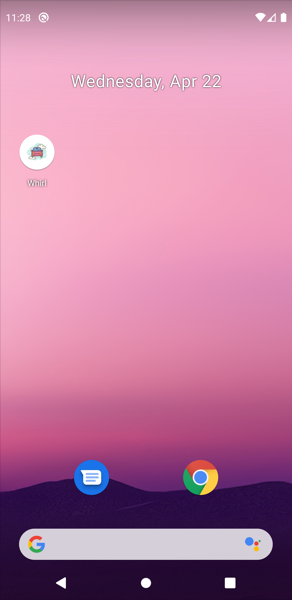
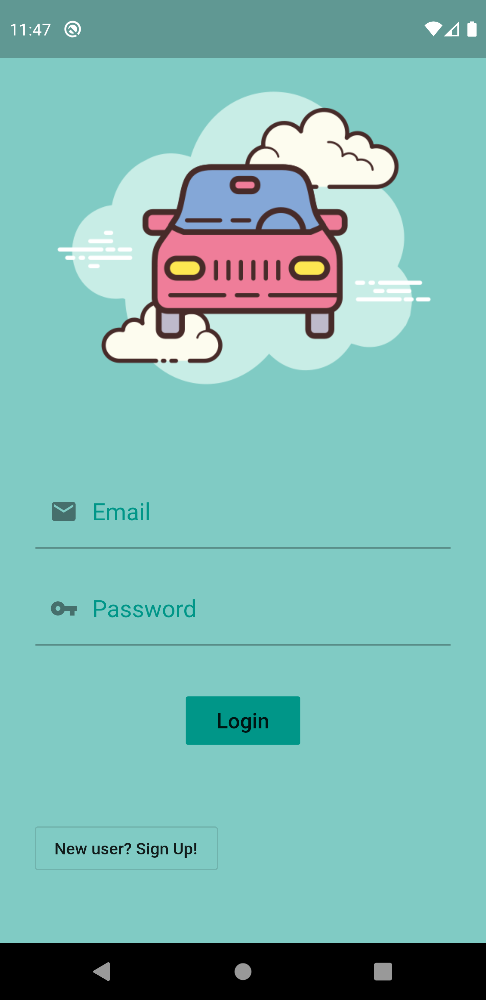
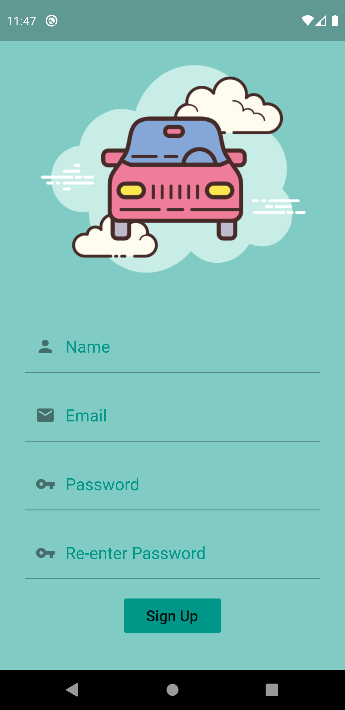
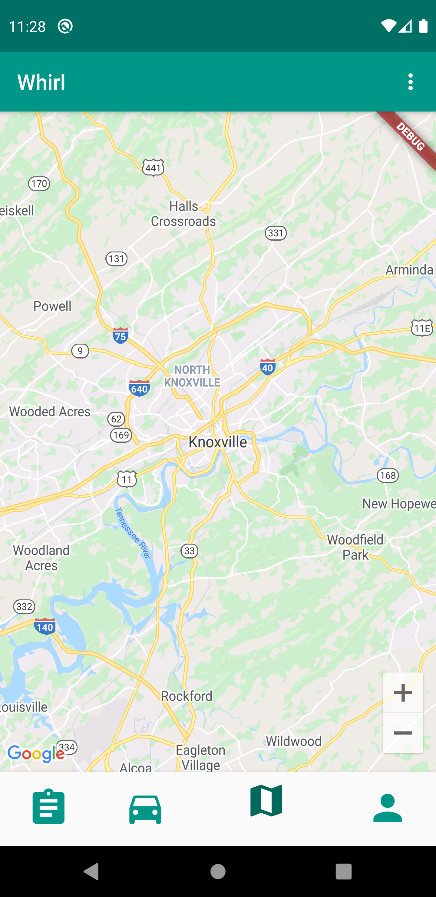
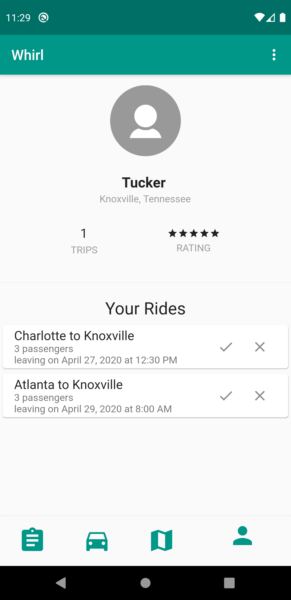
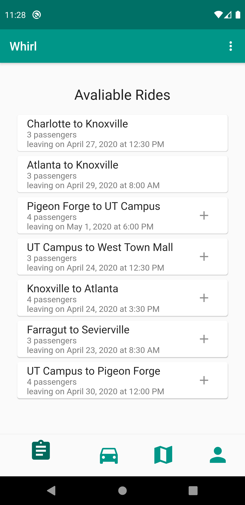
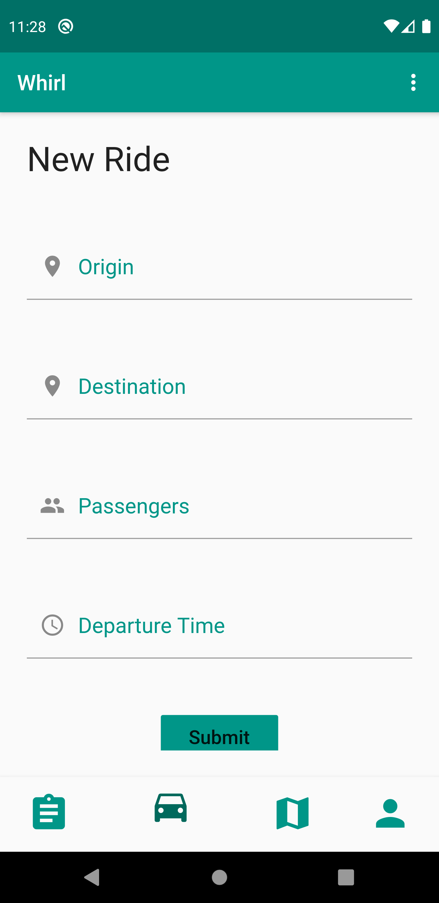

# **Whirl**

## **Team Name: Whirl**

## **Team Number: 4**

## **Team Members: Tucker Miles, Matt Mohandiss, David Nguyen, Vicki Tang, Jiuru Zhu**

## **Introduction**

### What is Whirl?

- Whirl is a ride-sharing app for college students. We plan to helps students find rides around campus or home for break.

### Team Whirl's Motivation

- Bad parking conditions on campus
- Some students don't have cars
- Help students afford trips
- Keeps students from being alone on long trips
- Safety

### Brief Description of Our Approach

- Towards the beginning of this project, we chose Flutter and Firebase for our technology stack, as one of us has a high level of experience with it, and for the others, the upfront cost of learning Flutter is relatively low when compared to numerous other frameworks. We did an immense amount of issue tracking throughout the entirety of the project, being sure to assign issues for nearly every task done and allowing us to individually work on small components of the greater project. This approach was very effective for us, as we now have a functional application. In the end, there is more work to be done, more features to be added, and occasional things to be improve, but we were successful in adding the pieces of functionality which were fundamental to our original plan.

## **Customer Value**

- No changes to customer value from previous report iterations. Below is customer value from our project proposal.

### Customer Need

- Our primary customers will be college students who want safe rides back to campus while on breaks, and to/from events around campus. We are doing this because we want to prioritize the safety of college students, and take into consideration the cost it takes to travel.

### Proposed Solution

- From the customer's point of view, our solution will take the anonymity out of carpooling, as it will be a student-only network. They will be able to get safe rides to and from their home and events around campus. When compared to typical ride-sharing services, Whirl will be more cost-effective and inclusive to students.
  
### Measures of Success

- We will know our app is successful if students are able to get free/cheap rides when they need them and feel safe while doing so.

## **Technology**

### Changes from status reports

- After completing our minimum viable system, our main goals were to introduce the list of actual rides to the user, as well as giving them a way to add to this list. Besides this,we wanted to add other features such as a profile and a map page. We successfully implemented the rides list functionality, added a profile page with basic functionality, and added a basic map as well. Below are screenshots of the several screens of the application.

 

 
 

 
 

 
 

### Testing

- Most of the testing for this application was relatively straight forward. Most of it consisted of making sure authentication was correct, and that the user was able to view and add rides to the app. We did all of this iteratively as each feature was added, in addition to regression testing with each new addition. Below is a table which summarizes our tests and their results.

## **Team**

- Every person on our team had tasks to work on throughout the course of the project. While the commits to the repository may seem lopsided, much work has been done elsewhere along the way. While it would have probably been better to switch up our roles more often, they have been mostly static.

## **Project Management**

- While we did complete everything that was required for the core functionality of our application, there is much more to be done that we would've loved to get a chance to look at. Most of this just comes down to time. Learning a completely new framework that you've never seen before is hard, and being able to work on your own with it is even harder. Adjusting our timeline to better enable everybody to work productively was necessary, and that is why we fell behind on a few aspects of our application. In addition to this, the unforeseen circumstances that everyone in the world is dealing with right now have also contributed to delays.

## **Reflection**

- For this iteration, things were a bit more unsystematic than prior sprints. With all of the craziness associated with all of the things happening at the current time, things got a bit off track. Our schedule fell apart a bit, but we've been able to recover and complete what we needed to accomplish in this iteration. Aside from that, we have closed numerous vital issues over the course of just a few short weeks. In addition to this, testing has gone very well, and it has not been necessary for us to pour valuable time into fixing bugs. Team management has been fairly consistent throughout the whole project. We've all been doing the tasks we've been assigned to do, and everything has been getting completed in a timely manner. Actually, the past couple weeeks have been the most productive weeks of the entire project, and it's very rewarding to see everything coming together.

- Lastly, we most definitely consider our project a success. While it is most definitely not a "complete" app, we have something that is very valuable to us. While we were fortunate enough to complete an actual working application with some of the features we wanted, Whirl has given us all much more than that. Developing an application from the ground up, and treating it as a real-life project in the workplace has given us all valuable skills that will be applied later in life. In addition to this, this project is an excellent addition to all of our portfolios, and is an even better talking point for future interviews.
