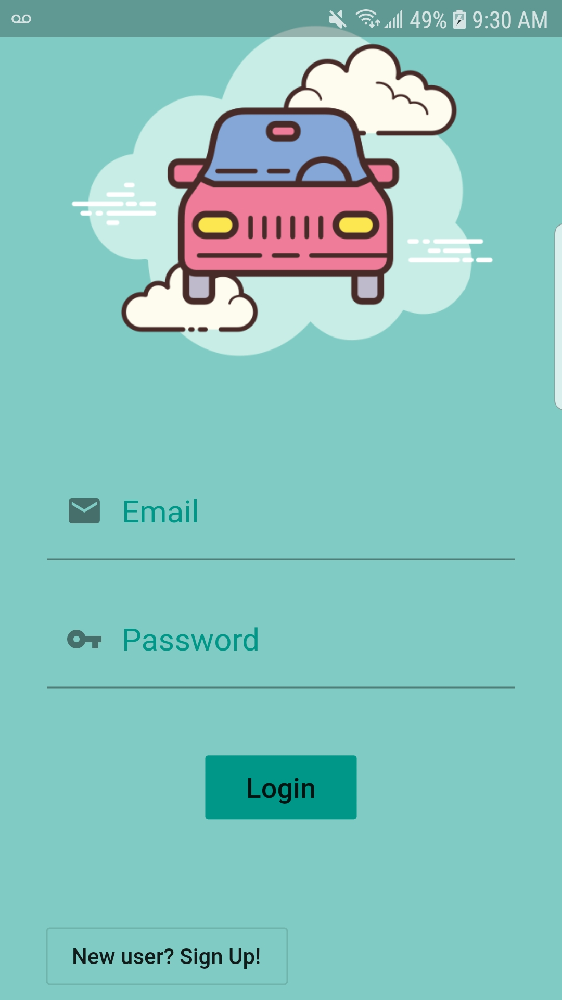
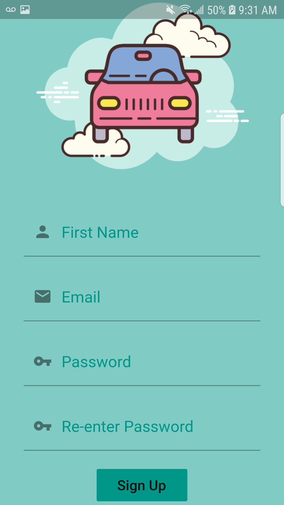
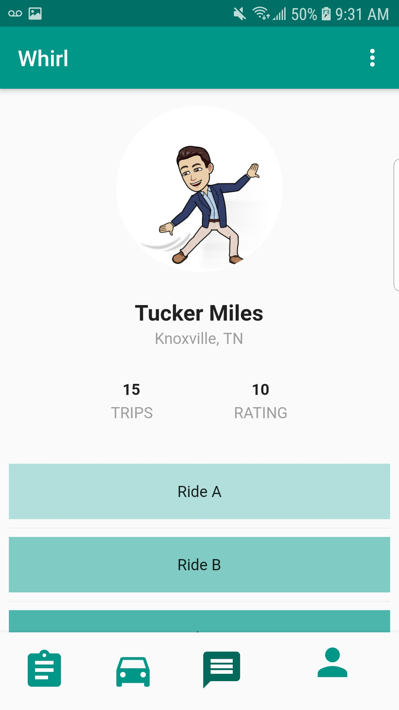
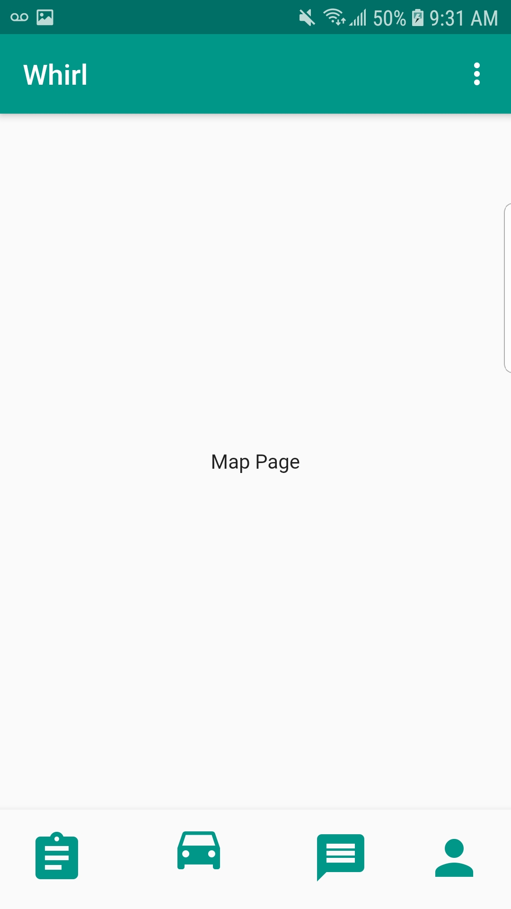
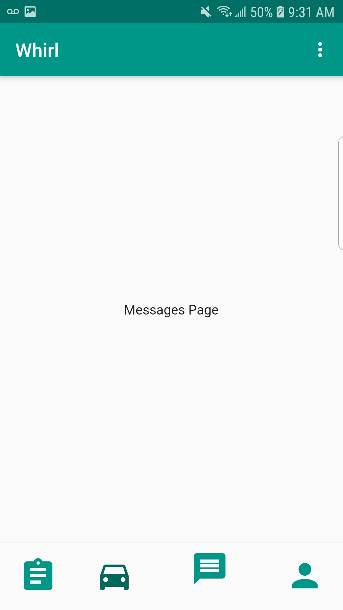
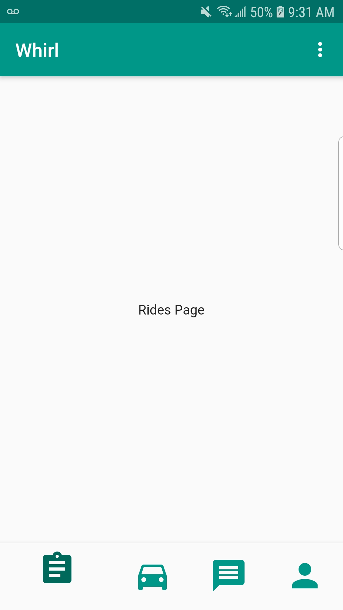
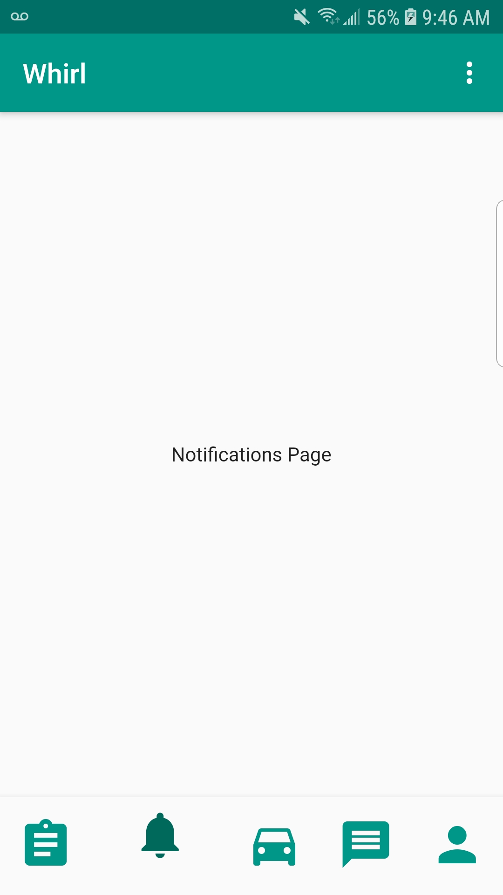

# **Whirl**

## **Team Name: Whirl**

## **Team Number: 4**

## **Team Members: Tucker Miles, Matt Mohandiss, David Nguyen, Vicki Tang, Jiuru Zhu**

## **Introduction**

With 74 total issues so far, and 68 of them closed, we have achieved a good minimum viable product which
includes many of the core features of the application. This gives us a solid foundation with which we plan build more functionality into, refine, and repeat. As of now, we are able to
create accounts, login and authenticate users, create "rides" which others can join, and generate a list of these "rides" with the information being pulled from our databases. Overall, we
haven't made any significant changes to our initial design requirements, and are staying fairly true to our original plan of action.

## **Customer Value**

Currently, we have altered the schdedule from the proposal.md due to our team members needing to take more time to get started and to familiarize themselves more with the framework. Also, we used more time to plan out the structure of our application with wireframes and a workflow chart. Allocating more time to that, we have been able to create a minimum viable product with more structure and organization and less bugs. The difference of the schedule has not caused any issues for our team or the project. It has helped us visualize our goals and how to split up the work.   

## **Technology**

As far as system architecture goes, the tech stack we initally planned to use is still the same, which is Flutter for the framework and firebase for the backend. We have not run into too many issues with incompatibilty, or just the outright inability to complete a task. We have wireframes made for the pages of the application to help with designing each of them and implement their functionality. Some of the goals were setting up and implementing a login page with sign-in and sign-up functionality and authentication. Along with getting a logo design in for the app and building a foundation for the other pages. 
 Currently, we have the login page functionality working and finished the layout of the app so navigation between pages are also working. We have tested the login functionality with firebase and checked if the users' accounts got to the backend. 
 Now, our goals for the next iteration would be to build the rides page, profile page, home page, the messaging page, and notification page. We will split up those pages among the members and hopefully, be able to implement some functionality into it. 

    

 

 

 

## **Team**

**Tucker:** I created a firebase system for the app's authentication from the login page and did the routing from there to the home page. I also built the profile page and got it to display some mock data. I expect my role to continue in both the front-end and back-end development and testing.  

**Matt:** I built the home page of the app along with other pages as a foundation for the other members to have a place to start. I also set up the navigation bar to the other pages and improved the sign in functionality. It included silent login where users who signed up/ logged in would stay logged in whenever they reopen the app and a log out option. I expect my role to continue in both the front-end and back-end development and testing. 

**David:** I worked on creating the logo for the app and implemented it in the login screen. While doing so, I fixed some minor bugs in the login screen. I expect to continue my role in the front-end development and help out in other areas of the project.

**Vicki:** In this iteration, I built the login page for the application and added the input functionality for signing in. I also created the wireframes for each page of the app. I expect my role to continue in the front-end development, testing, and helping with layout of the app.

**Jiuru:** 

## **Project Management**

For the most part, we managed to stay on track with our schedule, but we might have to push back the completion date to the month of April since we are still working on building the pages.

**Week of 1/27** - Become familiar with Flutter/Dart, polish proposal 
**Week of 2/3**  - Continue Learning/Experimenting with Flutter and Dart 
**Week of 2/10** - Design and implement a minimum viable system 
**Week of 2/17** - Iteratively improve minimum viable system 
**Week of 2/24** - Research potential updates/additional functionality 
**Week of 3/2**  - Choose new features we want, and begin implementation 
**Week of 3/9**  - Iteratively test and refine each change 
**Week of 3/16** - Iteratively test and refine each change 
**Week of 3/23** - Iteratively test and refine solution 
**Week of 3/30** - Iteratively test and refine solution and add finishing touches 
**Week of 4/6**  - Complete project implementation 

## **Reflection**

We planned out a basic workflow of the app and the wiresframes which gave us a good idea of how to get the front-end development of it built and how we wanted the app to function. It helped us break down each issue and assign it to the members at a steady pace. Overall, we were able to get a good minimum viable product completed and a solid foundation of the app at a timely fashion thanks to everyone's contributions and participation.
 

Throughout the project, the aspects that didn't go well would be building the project and running into unfamiliar errors/bugs when trying to implement and test a feature. However, we have been able to overcome it through researching and learning from trial and error.
  

As for now, we will continue to perform the same roles and implement the features we have planned out in a similar fashion.

